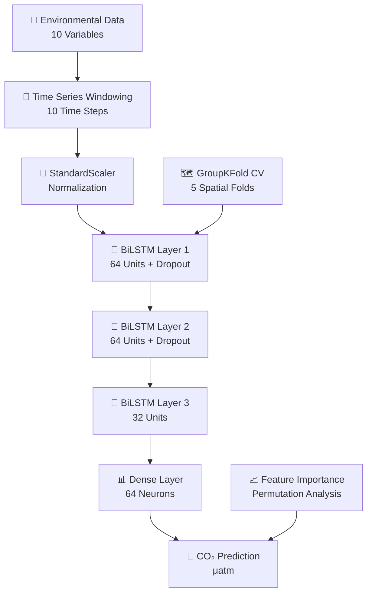

# 🌊 BiLSTM CO₂ Prediction for Antarctic Waters
### *Deception Island - Advanced Deep Learning for Marine Carbon Dynamics*

---

<div align="center">

[](https://python.org)
[](https://tensorflow.org)
[](#)
[](#)

**🔬 Scientific Deep Learning • 🌍 Climate Research • 📊 Time Series Prediction • 🧩 Data gap filling**

</div>

---

## 📋 **Project Overview**

<table>
<tr>
<td width="50%">

### 🎯 **Research Focus**
Predicting surface seawater CO₂ concentrations in Antarctic waters using state-of-the-art **Bidirectional LSTM** neural networks with comprehensive environmental data.

### 🌍 **Study Location**
**Deception Island, Antarctica** - A unique volcanic environment providing critical insights into ocean acidification and carbon cycle dynamics in polar waters.

</td>
<td width="50%">

### 📊 **Key Metrics**
- **🔮 Prediction Accuracy**: RMSE-optimized cross-validation
- **⏱️ Temporal Resolution**: 10-step windowing approach
- **🗺️ Spatial Coverage**: Latitude-based spatial grouping
- **🧠 Model Architecture**: Multi-layer BiLSTM with regularization

</td>
</tr>
</table>

---

## 🎨 **Visual Architecture**



---

## 🔬 **Scientific Methodology**

### 📊 **Environmental Variables**

<div style="display: grid; grid-template-columns: repeat(2, 1fr); gap: 20px;">

<div>

#### 🌊 **Oceanographic**
- 🌡️ **Seawater Temperature** - CO₂ solubility driver
- 🧂 **Salinity** - Chemical equilibrium factor

#### 🌤️ **Meteorological**
- ☀️ **Solar Radiation** - Photosynthesis driver
- 💨 **Wind Speed** - Air-sea exchange
- 🌡️ **Air Temperature** - Atmospheric coupling

</div>

<div>

#### 🗺️ **Spatial**
- 🧭 **Latitude/Longitude** - Geographic positioning

#### 🌋 **Geophysical**
- 🌊 **Tidal Elevation** - Water mass dynamics
- 📳 **Seismic Events** - Volcanic CO₂ release
- 📊 **Seismic 10-min Average** - Sustained activity

</div>

</div>

### 🔄 **Advanced Cross-Validation Strategy**

<table>
<tr>
<th>🎯 GroupKFold Validation</th>
<th>🧠 Model Training</th>
<th>📊 Performance Analysis</th>
</tr>
<tr>
<td>
• <strong>5-Fold Spatial Splits</strong><br>
• <strong>Latitude-based Grouping</strong><br>
• <strong>Prevents Data Leakage</strong><br>
• <strong>Realistic Evaluation</strong>
</td>
<td>
• <strong>Early Stopping (15 epochs)</strong><br>
• <strong>RMSprop Optimizer</strong><br>
• <strong>L2 Regularization</strong><br>
• <strong>Dropout (30%)</strong>
</td>
<td>
• <strong>RMSE Optimization</strong><br>
• <strong>Best Model Selection</strong><br>
• <strong>Permutation Importance</strong><br>
• <strong>Feature Ranking</strong>
</td>
</tr>
</table>

---

## 🚀 **Implementation Highlights**

### 🎯 **Deep Learning Architecture**

```python
# 🧠 BiLSTM Model Architecture
model = Sequential([
    🔄 Bidirectional(LSTM(64, return_sequences=True)) + L2(0.001)
    📉 Dropout(0.3)
    🔄 Bidirectional(LSTM(64, return_sequences=True)) + L2(0.001)
    📉 Dropout(0.3)
    🔄 Bidirectional(LSTM(32)) + L2(0.001)
    🧮 Dense(64, activation='relu')
    🎯 Dense(1, activation='linear')  # CO₂ Prediction
])
```

### 📊 **Data Processing Pipeline**

<div style="background: linear-gradient(135deg, #667eea 0%, #764ba2 100%); padding: 20px; border-radius: 10px; color: white;">

**🔍 Windowing Strategy**: 10 consecutive time steps → 1 prediction<br>
**📐 Scaling**: StandardScaler for features and target<br>
**🗂️ Grouping**: Latitude × 500 for spatial bins<br>
**⚡ Optimization**: RMSprop with 0.0005 learning rate

</div>

---

## 📈 **Results & Outputs**

### 🎯 **Model Deliverables**

<table>
<tr>
<td width="50%">

#### 📊 **Primary Outputs**
- 🎯 **`Deception_2025_CO2_prediction.csv`**
  - Date, Latitude, Longitude
  - CO₂ Real vs Predicted (μatm)
  - Best fold performance

</td>
<td width="50%">

#### 🔬 **Analysis Files**
- 📈 **`permutation_importance_fold{n}.csv`**
  - Feature importance per fold
  - RMSE increase quantification
  - Variable ranking

</td>
</tr>
</table>

### 🌟 **Key Performance Features**

<div style="display: grid; grid-template-columns: repeat(3, 1fr); gap: 15px;">

<div style="background: #e3f2fd; padding: 15px; border-radius: 8px; text-align: center;">
<strong>🎯 Spatial Independence</strong><br>
GroupKFold ensures robust geographic generalization
</div>

<div style="background: #f3e5f5; padding: 15px; border-radius: 8px; text-align: center;">
<strong>⏱️ Temporal Patterns</strong><br>
10-step windows capture short-term dynamics
</div>

<div style="background: #e8f5e8; padding: 15px; border-radius: 8px; text-align: center;">
<strong>🧠 Feature Intelligence</strong><br>
Permutation importance reveals key drivers
</div>

</div>

---

## 🛠️ **Technical Implementation**

### 💻 **Installation & Setup**

```bash
# 🐍 Create Environment
python -m venv bilstm_env
source bilstm_env/bin/activate  # Linux/Mac
# bilstm_env\Scripts\activate     # Windows

# 📦 Install Dependencies
pip install tensorflow==2.12.0 --no-deps
pip install numpy==1.23.5 pandas==1.5.3 scikit-learn==1.2.2 matplotlib==3.7.1

# ✅ Verify Installation
python -c "import tensorflow as tf; print('TensorFlow version:', tf.__version__)"
```

### 📁 **Project Structure**

```
📁 Deception_CO2_BiLSTM/
├── 📊 BiLSTM_CO2_CV_notebook.ipynb       # Main analysis notebook
├── 📈 Deception_2025_CO2_prediction.csv  # Final predictions
├── 📋 permutation_importance_fold*.csv   # Feature importance
├── 🗂️ Deception_2025_CO2_ocean_meteo_seismic.csv  # Input data
├── 📝 README.md                          # Project documentation
└── 📄 requirements.txt                   # Dependencies
```

---

## 🌊 **Scientific Impact**

<div style="background: linear-gradient(45deg, #2196F3, #21CBF3); padding: 30px; border-radius: 15px; color: white; text-align: center;">

### 🎓 **Research Applications**
**Ocean Acidification Studies • Climate Change Monitoring • Antarctic Research**

### 📚 **Publications**
*Flecha et al., 2025. Integrated meteocean and seismic dataset for AI-based seawater CO₂ estimation at Deception Island, Antarctica. Scientific Data. Submitted*

### 🏛️ **Institution**
**Instituto de Ciencias Marinas de Andalucía (ICMAN-CSIC)**

</div>

---

## 🤝 **Contributing & Contact**

<table>
<tr>
<td width="33%" align="center">

### 👩🏻‍🔬 **Author**
**Dr. Susana Flecha**

Marine Biogeochemistry & AI
ICMAN-CSIC

</td>
<td width="33%" align="center">

### 📧 **Contact**

susana.flecha@csic.es

</td>
<td width="33%" align="center">

### 🔗 **Resources**

Scientific Data Portal
Code Documentation

</td>
</tr>
</table>

---

<div align="center">

### 🌟 **Advancing Ocean Science Through AI**

*This project represents cutting-edge application of deep learning to marine carbon cycle research,*
*providing crucial insights for climate change understanding and Antarctic ecosystem monitoring.*

---

<sub>🔬 **Research Grade** | 🌍 **Climate Impact** | 🧠 **AI Innovation** | 📊 **Open Science**</sub>

</div>